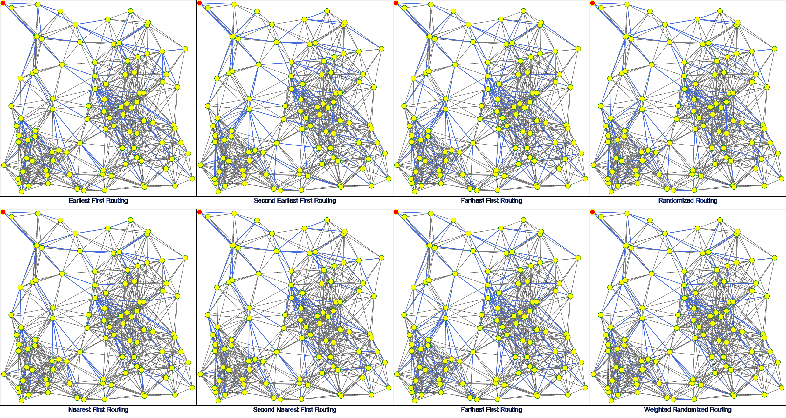
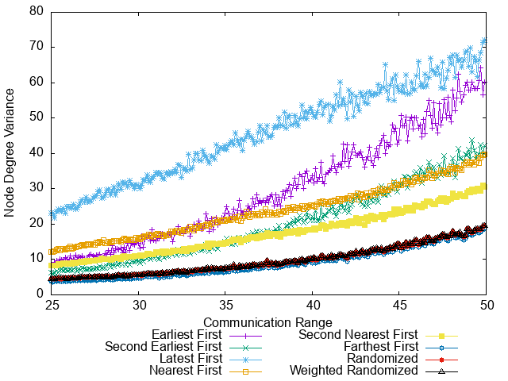
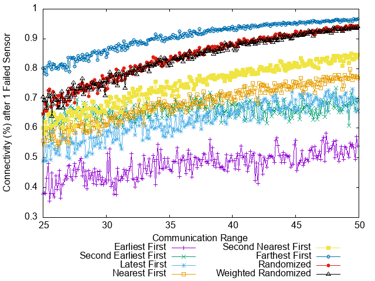
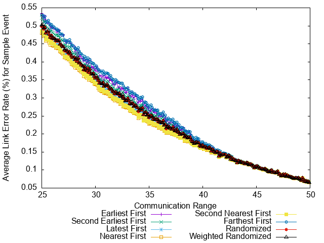
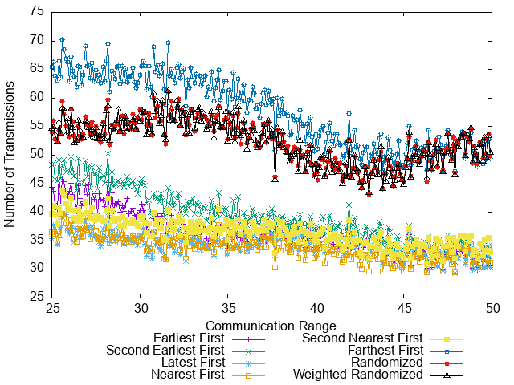
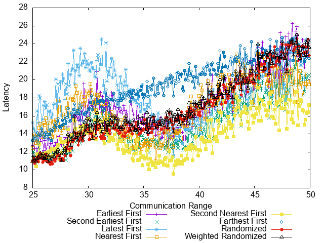

RASE - Routing Algorithm Simulation & Evaluation framework for Wireless Sensor Networks
==========================================

Author: Min Xu <xukmin at gmail.com>

Overview
--------
RASE is a simulator and evaluator for Wireless Sensor Network routing algorithms.

8 localized routing algorithms, 5 network structure & routing performance analyzers, and a sensor network simulator are implemented.

Simulation & Evaluation Outputs
-------------------------------

### Routing Trees

Routing Tree with 100 Sensors

Routing Tree with 200 Sensors

Routing Tree with 300 Sensors

Routing Tree with 400 Sensors

### Metrics

Node Degree Variance

Robustness

Channel Quality

Data Aggregation

Latency

Usage
-----

Build:

    make

Run the simulation, generate data file and PNG diagrams:

    make run

Run the simulation with customized configurations:

    ./run.sh <num_sensors> <repetitions> <lower_range> <upper_range> <range_step>

For example:

    ./run.sh 100 20 25.0 50.0 1

All parameters are optional. The default values are

    <num_sensors> = 100
    <repetitions> = 20
    <lower_range> = 25.0
    <upper_range> = 50.0
    <range_step> = 0.1

The generated files are:

- metrics-<num_sensors>-*.dat Data files in plain text format.
- metrics-<num_sensors>-*.png PNG images of the routing metric diagrams.
- routings-<num_sensors>*.png PNG images of the sample routing networks.

Dependencies
------------

- gnuplot 5.0 or above is needed to correctly generate PNG images.

- imagemagick is needed for converting SVG to PNG.

Simulation Methodology
----------------------

Pseudocode for the simulation procedure:

    for communication_range in [lower_range, upper_range); do
      repeat N times; do
        Generate a random set of n sensor positions, ensure its
            min_communcation_range <= communication_range;
        Create network and add channels based on communication_range;
        foreach routing_algorithm; do
          Build routing_topology;
          foreach routing_metric; do
            Calculate metric value and save it into a map of 
                [communication_range, routing_algorithm, routing_metric] =>
                    value;
          done
        done
      done
    done

